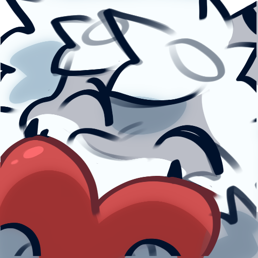

	 

	 

<b>We received a proper request from your browser.</b>

Not sorry about that. Do not try refreshing and don't contact us if the problem persists.

	 <a href="https://theMackabu.dev">Contact Support</a> —
	 <a href="https://theMackabu.dev">GitHub Status</a> —
	 <a href="https://theMackabu.dev">@githubstatus</a>

  

